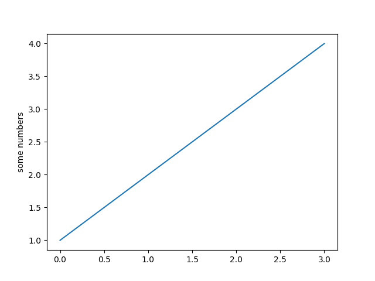
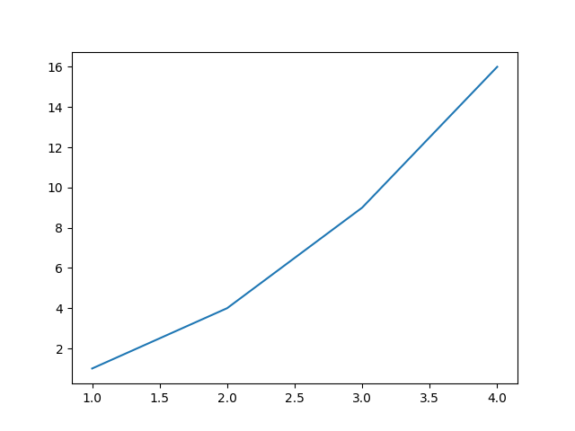

# MatPlotLib

**Matplotlib** is a comprehensive library for creating `static`, `animated`, and `interactive` visualizations.

## Install

import Tabs from '@theme/Tabs';
import TabItem from '@theme/TabItem';

<Tabs>
  <TabItem value="apple" label="pip" default>
    ```
    pip install matplotlib
    ```
  </TabItem>
  <TabItem value="orange" label="conda">
    ```
    conda install -c conda-forge matplotlib
    ```
  </TabItem>
</Tabs>

#

## Introduction to pyplot
#

`matplotlib.pyplot` is a collection of functions that make matplotlib work like MATLAB. Each pyplot function makes some change to a figure: e.g., creates a figure, creates a plotting area in a figure, plots some lines in a plotting area, decorates the plot with labels, etc.

:::note
In `matplotlib.pyplot` various states are preserved across function calls, so that it keeps track of things like the current figure and plotting area, and the plotting functions are directed to the current axes (please note that "axes" here and in most places in the documentation refers to the axes part of a figure and not the strict mathematical term for more than one axis).
:::

#

Generating **Visualizations** with `pyplot` is very quick:
#

```python title="HelloWorld.py"
import matplotlib.pyplot as plt

plt.plot([1, 2, 3, 4])
plt.ylabel('some numbers')
plt.show()
```

The **Graph** for the above code is:



#

You may be wondering why the `x-axis` ranges from 0-3 and the `y-axis` from 1-4. If you provide a single list or array to plot, matplotlib assumes it is a sequence of `y` values, and automatically generates the `x` values for you. Since python ranges start with 0, the default `x` vector has the same length as `y` but starts with 0; therefore, the `x` data are [0, 1, 2, 3].

Plot is a versatile function, and will take an arbitrary number of arguments. For example, to plot `x` versus `y`, you can write:

#

```python title="HelloWorld.py"
plt.plot([1, 2, 3, 4], [1, 4, 9, 16])
```

#



#